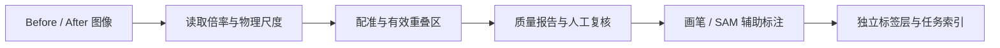

# SEM Registration Studio

**面向双时相 SEM 图像的配准、质量复核与 SAM 辅助标注桌面工具。**

将反应前后的显微图像对齐，在同步视图中标注孔隙与变化区域，并保存可复核的配准报告和独立标签层。基于 Python、OpenCV 和 Tkinter，SAM 推理由独立的本机服务提供。

> 本仓库仅发布源代码、测试和文档，不包含实验图片、实验数据、模型权重或实验运行记录。演示图片由脚本在本机随机合成。

## 功能

| 环节 | 实现 |
|---|---|
| 图像配准 | SEM 元数据读取、物理像素尺度统一、SIFT/ORB、RANSAC 局部仿射、ECC 精修 |
| 质量复核 | 匹配点覆盖率、重投影误差、有效重叠区、NCC、棋盘格与叠加图 |
| 交互标注 | 双侧孔隙、变化二分类、变化多分类；画笔、擦除、撤销与重做 |
| SAM 辅助 | 点提示、局部上下文、多候选轮廓、Before/After 独立交互 |
| 批量处理 | 图对扫描、人工确认配对、批量配准和已有结果质检 |
| 困难图对 | 人工对应点与独立检查点；可选 SuperPoint + LightGlue 匹配 |
| 数据保存 | 保留分析图位深；标签层分别保存；支持相对路径索引 |



## 快速开始

当前主要支持 **Windows 10/11、Python 3.11–3.12**。图形界面需要 Tkinter；官方 Windows Python 安装程序通常已包含它。配准和手工标注可在 CPU 上运行。

在项目根目录打开 PowerShell：

```powershell
python -m venv .venv
.\.venv\Scripts\python.exe -m pip install -r requirements.txt
.\.venv\Scripts\python.exe mask_editor_app.py
```

也可以双击 `start_integrated_editor.bat`，它优先使用项目的 `.venv`。

### 无实验数据演示

```powershell
.\.venv\Scripts\python.exe demo_synthetic.py
```

脚本创建随机纹理和已知平移图像，执行配准，在 `workspace/demo_时间戳/` 保存结果并打印打开命令。在界面点击“打开已有任务”，选择该目录即可体验画笔、标注层和保存功能。SAM 点选需要额外配置下方服务。

这些合成图不代表真实 SEM 图像，也不用于声称真实数据上的配准精度。脚本生成的全部文件均被 Git 忽略。

### 使用自己的图片

1. 选择 Before 和 After 原图，核对倍率与物理像素尺寸。
2. 点击“读取倍率并配准”，检查质量结论、棋盘格和叠加结果。
3. 配准通过后选择标注模式，用画笔或 SAM 候选进行修正。
4. 保存标注；之后可从“打开已有任务”继续编辑。

“高级工具”提供批量配准、结果质检、人工辅助配准和 OpenCV 处理功能。更多细节见 [使用说明](docs/USAGE.md)。

## 可选：连接 SAM

本项目包含 SAM 客户端，不包含模型、权重或服务端。已对接 [SAM Workbench API](https://github.com/siyuvision/sam-workbench-api) 的会话接口；请按其文档在**单独环境**安装服务端及所需模型。

在服务端环境运行：

```powershell
python -m uvicorn samapi.main:app --host 127.0.0.1 --port 8010 --workers 1
```

再启动本编辑器，点击“检测服务”。默认模型为 `sam2_s`，是否可用取决于服务端安装的模型。仅运行一个 worker，避免会话状态分散。

若服务端使用其他端口，在启动编辑器前设置：

```powershell
$env:SAM_API_URL = "http://127.0.0.1:8000/sam"
.\.venv\Scripts\python.exe mask_editor_app.py
```

SAM 未连接时，配准及手工标注仍可使用。默认请求只发送至本机；自行修改 `SAM_API_URL` 为远程地址会将选中的图像区域发送到该服务。

## 本地工作区

默认生成文件位于项目的 `workspace/`。也可在启动前指定：

```powershell
$env:SEM_WORKSPACE = "D:\sem-workspace"
.\.venv\Scripts\python.exe mask_editor_app.py
```

打开已有数据集时，标签会保存到该任务/索引指定的标注目录。原始图像不会被覆盖，但保存标注会更新当前任务的标签文件。

## 开发与验证

```powershell
.\.venv\Scripts\python.exe -m pip install -r requirements-dev.txt
.\.venv\Scripts\python.exe -m unittest discover -s . -p "test_*.py" -v
```

测试覆盖合成变换配准、物理尺度、16 位图像读写、图对确认、标注层隔离、保存重载、撤销重做及 SAM 多边形栅格化。GUI 测试需要可用的桌面/Tk 环境；测试不需要模型权重、GPU 或实验图片，不验证真实 SAM 推理质量。

仓库提供 Windows / Python 3.11、3.12 的 GitHub Actions 配置。首次整理时，本机 Windows / Python 3.11 已通过 54 项测试。

## 项目结构

```text
mask_editor_app.py           桌面界面与交互
registration_pipeline.py     配准、尺度处理与报告
batch_registration*.py       批量扫描、配准和质检
manual_registration_ui.py    人工对应点与检查点
annotation_modes.py          标注模式与标签持久化
sam_client.py                SAM HTTP 会话客户端
enhanced_matching.py         可选 LightGlue 匹配
image_processing.py          OpenCV 图像处理
dataset_paths.py             索引相对路径处理
build_named_sem_dataset.py   特定 SEM 目录规则的数据集构建工具
verify_named_dataset.py      已构建数据集的校验工具
demo_synthetic.py            纯合成数据演示
test_*.py                   自动测试
docs/                       使用说明与第三方来源
```

## 方法边界与来源

配准质量分数是自动初检依据，拟合点残差不能代替独立检查点误差。跨倍率定位不能直接视为定量变化证据。SAM 输出和初始化空白标签均需人工检查，不能自动当作真值。真实结构变化也可能降低图像相关性。

本项目集成已有的计算机视觉方法与 SAM 服务，不将 SIFT、ECC、SAM 或 LightGlue 声称为原创模型。第三方来源及许可边界见 [THIRD_PARTY.md](docs/THIRD_PARTY.md)。
